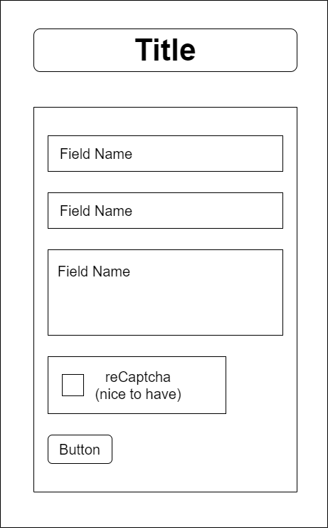

# Project Plan -- Contact Form

A contact form is an essential part of any business website or developer portfolio. It provides an easy way for users to get in touch with the business or individual, so they can reach their customers. Users simply need to fill out the form with their contact information and a short message and click submit. The business can then view the contact form entries in the database to then get back to the users. 

* Bonus item #1: Have the form send an email to the form owner upon submit.
* Bonus item #2: Setup reCaptcha to help prevent spam.

## Wireframes

## Dependencies

* React
* Firebase
* Nodemailer (bonus)
* Axios (bonus)
* reCaptcha (bonus)

## Tasks

* Setup create-react-app scaffold - Week 1
* Setup contact form component - Week 1
* Setup Firestore database - Week 1
* Setup contact form component to send entries to Firestore DB upon submit - Week 1
* Deploy - Week 2
* Style with CSS - Week 2
* Bonus item #1: Setup Nodemailer and Axios to have the contact form send an email to the form owner upon submit - Week 2
* Bonus item #2: Setup reCaptcha - Week 2